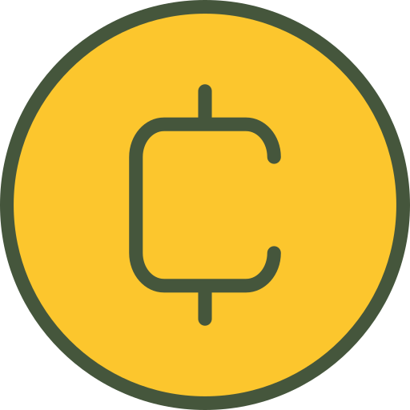

# Crypto-Project-using-js
## Hosted Link:- https://rohitdhawale07.github.io/Crypto-Project-using-js/CryptoCurrency.html

This is the project of creating a website of Crypto Currency by using HTML, CSS and JAVACRIPT.
When we search some crypto currenct in serach box it will automatically give us serached currency data along with more description.
Inintially we created html section for each pages.

## HTML for front page
```
<!DOCTYPE html>
<html lang="en">
  <head>
    <meta charset="UTF-8" />
    <meta name="viewport" content="width=device-width, initial-scale=1.0" />
    <title>Document</title>
    <link rel="stylesheet" href="./cryptoCurrency.css" />
  </head>
  <body>
    <!-- header -->
    <nav>
      <div class="headerDiv">
        
        <a href="./CryptoCurrency.html">
          <h1>CryptoView</h1>
        </a>
      </div>
      <a href="./search.html">
        <button>search</button>
      </a>
    </nav>
    <!-- main -->
    <section>
      <div class="mainContainer">
        <div class="textContainer">
          <h1>CryptoView</h1>
          <p>A platform to view information about all cryptocurrencies live.</p>
        </div>
        <div class="imgContainer">
          
        </div>
      </div>
    </section>
    <!-- topCoin -->
    <div class="topCoinMainContainer">
      <h2>Top Coins</h2>
      <div class="TopCoinsDiv scrollbar" id="TopCoinsDiv"></div>
    </div>

    <!-- footer -->
    <footer>
      <p>CryptoView Project By Rohit D.</p>
      
    </footer>
    <script src="./cryptoCurrency.js"></script>
  </body>
</html>
```
## CSS:-
```
@import url('https://fonts.googleapis.com/css2?family=Lato:ital@1&family=Mooli&family=Open+Sans:ital,wght@0,300;0,400;0,500;1,300&family=Roboto:wght@300&display=swap');

 * {
  margin: 0;
  padding: 0;
  box-sizing: border-box;
  font-family: 'Open Sans', sans-serif;
  letter-spacing: 1px;
}

*::-webkit-scrollbar{
    display: none;
}

nav {
  display: flex;
  justify-content: space-between;
  padding: 1rem 4rem;
  width: 100%;
  height: 10vh;
  align-items: center;
}

.headerDiv {
  display: flex;
  width: 15%;
  height: 100%;
  align-items: center;
  justify-content: space-between;
}

.headerDiv a {
  text-decoration: none;
  width: 60%;
  color: black;
}
.headerDiv img {
  width: 50px;
  height: 50px;
}

nav a {
  width: 10%;
  height: 100%;
  display: flex;
  text-decoration: none;
}

nav a button {
  width: 100%;
  height: 100%;
  border: none;
  outline: none;
  background-color: rgb(255, 140, 0);
  font-size: 1rem;
  border-radius: 10px;
  font-weight: 700;
  box-shadow: 2px 2px 3px grey;
  transition: .2s  ease-in-out;
}
nav a button:hover{
  cursor: pointer;
  background-color: #fff;
  color: #333;
  box-shadow: rgba(50, 50, 93, 0.25) 0px 30px 60px -12px inset, rgba(0, 0, 0, 0.3) 0px 18px 36px -18px inset;}

.mainContainer {
  height: 60vh;
  display: flex;
  justify-content: space-between;
  background-color: rgb(238, 238, 238);
}

.mainContainer .textContainer {
  width: 50%;
  display: flex;
  flex-direction: column;
  justify-content: center;
  align-items: center;
  text-align: center;
}

.textContainer h1 {
  font-size: 3rem;
  text-shadow: 2px 2px 4px rgba(0, 0, 0, .7);

}

.textContainer p {
  font-size: 1.2rem;
}

.imgContainer {
  width: 50%;
  display: flex;
  justify-content: center;
  align-items: center;
}

.imgContainer img {
  width: 50%;
  height: 100%;
}

.topCoinMainContainer {
  height: 20vh;
  display: flex;
  flex-direction: column;
  justify-content: space-between;
  align-items: center;
  background-color: rgb(238, 238, 238);
  position: relative;
  white-space: noWrap;
}

#TopCoinsDiv {
  display: flex;
  height: 90%;
  width: 100%;
  overflow-x: scroll;
  align-items: center;
  position: relative;
}

/* .scrollbar{
  border: 2px solid red;
  margin-top: 1rem;
  position: absolute;
  
  animation: scroll 20s linear infinite ;
}

@keyframes scroll{
  0% {
    left: 100%; 
}
100% {
    left: -100%; 
}
} */

footer {
  height: 10vh;
  display: flex;
  justify-content: space-between;
  align-items: center;
  padding: 1rem 4rem;
}

footer img {
  width: 50px;
  height: 50px;
}

.searchSectionMainContainer {
  height: 80vh;
  background-color: rgb(238, 238, 238);
  display: flex;
  flex-direction: column;
  justify-content: center;
  align-items: center;
}

.searchContaner {
  width: 100%;
  display: flex;
  flex-direction: column;
  justify-content: space-around;
  align-items: center;
  height: 20%;
}

.searchContaner form input {
  padding: 0.5rem 1rem;
  
}

.searchContaner input[type="text"] {
  width: 80ch;
  border: none;
  border-radius: 6px;
  box-shadow: rgba(0, 0, 0, 0.16) 0px 3px 6px, rgba(0, 0, 0, 0.23) 0px 3px 6px;
}
.searchContaner input[type="button"] {
  cursor: pointer;
  border: none;
  border-radius: 6px;
  box-shadow: rgba(50, 50, 93, 0.25) 0px 30px 60px -12px inset, rgba(0, 0, 0, 0.3) 0px 18px 36px -18px inset;
}
.searchContaner input[type="button"]:hover{
  background-color: #333;
  color: white;
  font-weight: 600;
}

.searchResultContainer {
  height: 80%;
}


.topcoinsCardContainer {
  display: flex;
  padding: 1rem;
  min-width: 350px;
  height: 80px;
  margin: 0 2rem;
  background-color: white;
  box-shadow: 2px 2px 3px grey;
  justify-content: space-around;
  align-items: center;
}

.topcoinsCardContainer img{
    width: 40px;
    height: 40px;
}
```

this code fetches the conversion rate for Bitcoin to INR and a list of trending coins 
from the CoinGecko API, calculates the prices in INR, and then dynamically displays the trending coins on the web page 
with their logos, names, and converted prices.
The getCurrentConversionRate function is an asynchronous function that fetches the current conversion rate for Bitcoin to INR from the CoinGecko API.

After fetching the data, it extracts the conversion rate and calls the loadTopCoins function with this rate as a parameter.

The loadTopCoins function is also asynchronous and fetches a list of trending coins from the CoinGecko API.

After fetching the trending coin data, it calls the renderTopCoinsOnScreen function, passing both the conversion rate and the trending coin data as parameters.

The renderTopCoinsOnScreen function takes the conversion rate and the trending coins data and iterates over each trending coin.

For each trending coin, it extracts the coin's logo, name, and price in Bitcoin. It calculates the price in INR by multiplying the Bitcoin price by the conversion rate.

It then calls the createCard function to create a card for each coin with its logo, name, and price.

The createCard function creates a card element with an image, name, and price. It sets the image source to the coin's logo URL and populates the name and price.

These card elements are appended to a container with the ID "TopCoinsDiv" on the web page.

Finally, the window.onload event handler is set to call the getCurrentConversionRate function when the web page is fully loaded, triggering the initial loading of conversion rates and trending coins.
## JAVASCRIPT code for front page:-
```
const getCurrentConversionRate = async () => {
  const data = await fetch(
    "https://api.coingecko.com/api/v3/simple/price?ids=bitcoin&vs_currencies=inr"
  );
  const res = await data.json();
  loadTopCoins(res);
};

const loadTopCoins = async (data) => {
  const conversionRate = data.bitcoin.inr;
  const trendingCoins = await fetch(
    "https://api.coingecko.com/api/v3/search/trending"
  );
  const res = await trendingCoins.json();
  renderTopCoinsOnScreen(conversionRate, res);
};

const renderTopCoinsOnScreen = (conversionRate, topCoins) => {
  console.log(conversionRate, topCoins);
  for (let i = 0; i < topCoins.coins.length; i++) {
    const coinData = topCoins.coins[i].item;
    const logo = coinData.thumb;
    const name = `${coinData.name} (${coinData.symbol})`;
    const price =
      Math.round(coinData.price_btc * conversionRate * 10000) / 10000;
    createCard(logo, name, price);
  }
};

const createCard = (logo, name, price) => {
  console.log(logo, name, price);
  const cardContainer = document.createElement("div");
  cardContainer.classList.add("topcoinsCardContainer");

  const img = document.createElement("img");
  img.src = logo;
  img.classList.add("topCoinsLogoImg");

  const div = document.createElement("div");
  div.classList.add("nameAndPriceContainerTopCoins");

  const name2 = document.createElement("h2");
  name2.innerText = name;

  const price2 = document.createElement("p");
  price2.innerText = price;

  div.appendChild(name2);
  div.appendChild(price2);

  cardContainer.appendChild(img)
  cardContainer.appendChild(div)
  document.getElementById("TopCoinsDiv").appendChild(cardContainer)
};

window.onload = function () {
  getCurrentConversionRate();
};
```

## HTML for Search Page:-
```
<!DOCTYPE html>
<html lang="en">
  <head>
    <meta charset="UTF-8" />
    <meta name="viewport" content="width=device-width, initial-scale=1.0" />
    <title>Document</title>
    <link rel="stylesheet" href="./cryptoCurrency.css" />
    <link rel="stylesheet" href="./search.css">
    <script defer src="./search.js"></script>
  </head>
  <body>
    <!-- header -->
    <nav>
      <div class="headerDiv">
        
        <a href="./CryptoCurrency.html">
          <h1>CryptoView</h1>
        </a>
      </div>
      <a href="./search.html">
        <button>search</button>
      </a>
    </nav>
    <div class="searchSectionMainContainer">
      <div class="searchContaner" >
        <h1>Search</h1>
        <form method="get">
          <input type="text" id="search-input" name="q"/>
          <input type="submit" value="Search" id="search-btn"/>
        </form>
      </div>
      <hr />
      <div class="searchResultContainer"></div>
    </div>
    <footer>
      <p>CryptoView Project By Rohit D.</p>
      
    </footer>
  </body>
</html>
```
## CSS
```
.searchResultContainer{
    /* border:2px solid red; */
    overflow-y: scroll;
}

.searchContainer22{
    margin-bottom: 1rem;
    /* max-width: 100%; */
}
.searchContainer22:hover{
    border: 2px solid #333;
    border-radius: 10px;
}

.searchContainer22 h4{
    width: 5%;
    /* border: 1px solid red; */
}


.searchContainer22 div{
    width: 60%;
    /* border: 2px solid green; */
}
.searchContainer22 div a{
    text-decoration: none;
}
#search-btn{
    background-color: royalblue;
    color: white;
    font-weight: 600;
    border: none;
    cursor: pointer;
    border-radius: 5px;
    /* font-size: 1rem; */
    transition: 0.2s ease-in-out;
}
#search-btn:hover{
    background-color: #333;
    color: white;
}
```

The searchData function is defined, which is an asynchronous function responsible for fetching and rendering coin data based on the search query parameter in the URL.

It starts by getting the current URL using window.location.href and then creates a URL object to parse the URL and extract the search parameters using URLSearchParams.

If there's no "q" parameter in the URL, the function returns early, indicating that there's no search query to perform.

If there is a "q" parameter, it sets the value of an input field with the name "q" to the search query value obtained from the URL.

It then makes an asynchronous fetch request to the CoinGecko API with the search query as a parameter.

After receiving a response, it converts the response to JSON and calls the renderCoinsOnScreen function with the retrieved data.

The renderCoinsOnScreen function takes the coin data and iterates over each coin in the data. For each coin, it extracts relevant information 
such as the coin's name, symbol, ID, and thumbnail URL.

It then calls the createCard function to create a card for each coin. 
These cards are appended to a container with the class "searchResultContainer" on the web page.

The createCard function creates a card element for each coin with its index, logo, name, and a link for "More Details."

Finally, the window.onload event handler is set to call the searchData function when the web page is
fully loaded, triggering the initial search based on the URL parameters.

In summary, this code allows users to search for coins using a query parameter in the URL, fetches data from the CoinGecko API, and dynamically displays the results on the web page in the form of cards with links to more details for each coin.
## JAVASCRIPT Code for Search Page:-
```
const searchData = async () => {
    const currentPath = window.location.href;
    const urlObj = new URL(currentPath);
    const params = new URLSearchParams(urlObj.search);
    if (!params.has("q")) {
      return;
    }
  
    document.getElementsByName("q")[0].value = params.get("q");
    const res = await fetch(
      `https://api.coingecko.com/api/v3/search?query=${params.get("q")}`
    );
    const data = await res.json();
    renderCoinsOnScreen(data);
  };
  
  const renderCoinsOnScreen = (data) => {
    console.log(data.coins);
    for (let i = 0; i < data.coins.length; i++) {
      const coinData = data.coins[i];
      const index = i + 1;
      const logo = coinData.thumb;
      const name = `${coinData.name} (${coinData.symbol})`;
      const coinId = coinData.id;
      createCard(index, logo, name, coinId);
    }
  };
  
  const createCard = (index, logo, name, coinId) => {
    // console.log(logo, name, coinId);
    const cardContainer = document.createElement("div");
    cardContainer.classList.add("topcoinsCardContainer");
    cardContainer.classList.add("searchContainer22");
  
    const Index = document.createElement("h4");
    Index.innerText = index;
  
    const img = document.createElement("img");
    img.src = logo;
    img.classList.add("topCoinsLogoImg");
  
    const div = document.createElement("div");
    div.classList.add("nameAndPriceContainerTopCoins");
  
    const name2 = document.createElement("h3");
    name2.innerText = name;
  
    const price2 = document.createElement("p");
    price2.innerText = coinId;
  
    div.appendChild(name2);
    div.appendChild(price2);
  
    const moreDetails = document.createElement("a");
    moreDetails.innerText = "More Details";
    moreDetails.href = "./detail.html?id=" + coinId;
  
    cardContainer.appendChild(Index);
    cardContainer.appendChild(img);
    cardContainer.appendChild(div);
    cardContainer.appendChild(moreDetails);
    document.querySelector(".searchResultContainer").appendChild(cardContainer);
  };
  
  window.onload = function () {
    searchData();
  };
```
## HTML Code for Details Page:-
```
<!DOCTYPE html>
<html lang="en">
  <head>
    <meta charset="UTF-8" />
    <meta name="viewport" content="width=device-width, initial-scale=1.0" />
    <title>Document</title>
    <link rel="stylesheet" href="./cryptoCurrency.css" />
    <link rel="stylesheet" href="./detail.css">
    <script defer src="./detail.js"></script>
  </head>
  <body>
    <!-- header -->
    <nav>
      <div class="headerDiv">
        
        <a href="./CryptoCurrency.html">
          <h1>CryptoView</h1>
        </a>
      </div>
      <a href="./search.html">
        <button>search</button>
      </a>
    </nav>
    <div class="searchSectionMainContainer" id="searchSectionMainContainer33"></div>
    <footer>
      <p>CryptoView Project By Rohit D.</p>
      
    </footer>
  </body>
</html>
```
## CSS for Details Page:-
```
#searchSectionMainContainer33 {
  overflow-y: scroll;
  padding: 2rem;
  margin-top: rem;
}
.detailsSection img {
  /* border: 2px solid red; */
  width: 80px;
  height: 80px;
  margin: 1rem;
  /* margin-top: 11rem; */
}

.detailsSection div {
  /* border: 2px solid red; */
  margin: 1rem;
  padding: 0.5rem;
  display: flex;
  gap: 3rem;
}

.detailsSection {
  /* border: 2px solid red; */
  display: flex;
  position: absolute;
  flex-direction: column;
  align-items: center;
  justify-content: center;
  padding: 1rem;
  background-color: white;
  border-radius: 10px;
  /* left: 50%;
  right: 50%;
  transform: translate(-50%,-50%); */

}
.detailsSection h2{
    border-bottom: 1px solid lightgrey;
}
.detailsSection p{
    max-width: 70%;
}
```

this code fetches and displays details of a cryptocurrency based on the "id" parameter in the URL, including its name, 
description, logo, and current prices in various currencies. 
It does so by making a request to the CoinGecko API and rendering the data on the web page.
The loadDetails function is defined as an asynchronous function. It first logs a message indicating that the details are being loaded.

It then retrieves the current URL using window.location.href and parses it using the URL object to extract the search parameters using URLSearchParams.

If the "id" parameter is not present in the URL, it redirects the user to "./CryptoCurrency.html" (presumably a page for listing cryptocurrencies).

If the "id" parameter is present, it constructs a URL to fetch details of the cryptocurrency from the CoinGecko API. 
It specifies various query parameters to customize the data retrieved.

It fetches the cryptocurrency data from the API, waits for 
the response, and then parses the response as JSON.

The retrieved cryptocurrency data is then passed to the renderDetails function.

The renderDetails function takes the cryptocurrency data as a parameter and extracts various pieces of information such as the name, 
description, logo, and current prices in different currencies (INR, USD, EUR, GBP).

It creates HTML elements to display this information, including an image for the logo, a paragraph for the 
description, and a container for displaying prices.

The price information is displayed in a structured format with headings for each currency.

The constructed card with all the details is appended to an element with the ID "searchSectionMainContainer33" on the web page.

The window.onload event handler is set to call the loadDetails function when the web page is fully loaded, which triggers the loading and rendering 
of cryptocurrency details based on the "id" parameter in the URL.

## JAVASCRIPT code for Details page :-
```
const loadDetails = async () => {
  console.log("details loaded");
  const currentPath = window.location.href;
  const urlObj = new URL(currentPath);
  const params = new URLSearchParams(urlObj.search);
  if (!params.has("id")) {
    window.location.href = "./CryptoCurrency.html";
  }
  const data = await fetch(
    `https://api.coingecko.com/api/v3/coins/${params.get(
      "id"
    )}?localization=false&tickers=false&market_data=true&community_data=false&developer_data=false&sparkline=false`
  );
  const res = await data.json();
  console.log(res);
  renderDetails(res);
};

// loadDetails()

const renderDetails = (coin) => {
  console.log(coin);
  const name = `${coin.name} (${coin.symbol.toUpperCase()})`;
  console.log(name);
  const desc = coin.description.en;
  console.log(desc);
  const logo = coin.image.large;
  console.log(logo);

  const inr = coin.market_data.current_price.inr;
  const usd = coin.market_data.current_price.usd;
  const eur = coin.market_data.current_price.eur;
  const gbp = coin.market_data.current_price.gbp;
  console.log(inr, usd, eur, gbp);

  const card = document.createElement("div");
  card.classList.add("detailsSection");
  const logoImg = document.createElement("img");
  logoImg.src = logo;
  const descDiv = document.createElement("p");
  descDiv.innerText = desc;
  const priceContainer = document.createElement("div");
  const heading = document.createElement("h2");
  heading.innerText = "Coin Price"
  const inrPrice = document.createElement("h3");
  inrPrice.innerText = "INR:- " + inr;
  const usdPrice = document.createElement("h3");
  usdPrice.innerText = "USD:- " + usd;
  const eurPrice = document.createElement("h3");
  eurPrice.innerText = "EUR:- "+ eur;
  const gbpPrice = document.createElement("h3");
  gbpPrice.innerText = "GBP:- "+ gbp;
  priceContainer.appendChild(heading)
  priceContainer.appendChild(inrPrice);
  priceContainer.appendChild(usdPrice);
  priceContainer.appendChild(eurPrice);
  priceContainer.appendChild(gbpPrice);

  card.appendChild(logoImg);
  card.appendChild(descDiv);
  card.appendChild(priceContainer);

  document.getElementById("searchSectionMainContainer33").appendChild(card);
};
window.onload = function () {
  loadDetails();
};
```


